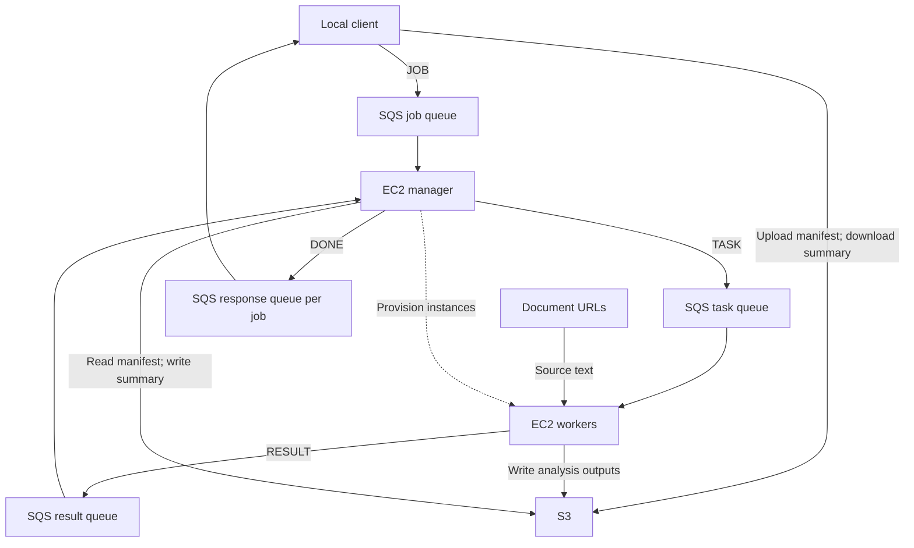

# Distributed Text Analysis on AWS

A Java application that distributes text-analysis jobs across EC2 workers using Amazon SQS and S3.

A local client submits a file containing document URLs and analysis types. A manager provisions workers, schedules tasks, and collects their results. Workers download the documents and run Stanford CoreNLP; the client receives an HTML summary linking each input to its analysis output.

**Stack:** Java 11 · Maven · AWS SDK for Java v2 · EC2 · SQS · S3 · Stanford CoreNLP

## Supported analyses

| Analysis | Output |
| --- | --- |
| `POS` | Words paired with part-of-speech tags |
| `CONSTITUENCY` | Constituency parse trees for each sentence |
| `DEPENDENCY` | Dependency graphs for each sentence |

The worker uses English NLP models and processes text line by line, with a limit of 500,000 text characters per task.

## Architecture



| Component | Responsibilities | Entry point |
| --- | --- | --- |
| Local client | Finds or launches the manager, uploads the input manifest, creates a response queue, and downloads the completed summary | [LocalMain.java](local/src/main/java/local/LocalMain.java) |
| Manager | Reads jobs, provisions workers, dispatches tasks, collects results, and generates HTML summaries | [ManagerMain.java](manager/src/main/java/manager/ManagerMain.java) |
| Worker | Downloads source text from a URL, runs the requested analysis, writes output to S3, and reports success or failure | [WorkerMain.java](worker/src/main/java/worker/WorkerMain.java) |

Each nonblank input line represents one analysis task. Documents are distributed by URL; the manager does not split document contents into chunks.

## Distributed processing

- **Worker provisioning:** For a job with `T` tasks and a positive tasks-per-worker argument `n`, the manager targets `min(19, ceil(T / n))` workers. It reuses running or pending workers and launches additional instances when needed.
- **Concurrent jobs:** The manager dispatches jobs through a Java executor. Each client creates a dedicated SQS response queue so completion notifications are delivered to the submitting client.
- **Result deduplication:** The manager tracks task IDs in an in-memory map and ignores duplicate results within the current job execution.
- **S3 recovery checks:** The manager can recover missing result records by checking whether the expected nonempty output objects exist in S3. These checks currently run after a nonempty result-queue poll.
- **Error reporting:** Workers send `OK` or `ERROR` results. The HTML summary includes output links for successful tasks and error details for failed tasks.
- **Instance lifecycle:** The optional `terminate` argument requests shutdown of the manager and worker instances after current jobs complete.

SQS messages use the following visibility settings in the code:

| Message | Visibility timeout |
| --- | --- |
| Job request | 3,600 seconds |
| Worker task | 1,200 seconds |
| Worker result | 600 seconds |
| Client response | 300 seconds |

These timeouts are fixed; the implementation does not extend them while a task is running. Standard SQS queues can deliver a message more than once, so duplicate execution remains possible. See [AWS delivery semantics](https://docs.aws.amazon.com/AWSSimpleQueueService/latest/SQSDeveloperGuide/standard-queues-at-least-once-delivery.html) and [visibility timeouts](https://docs.aws.amazon.com/AWSSimpleQueueService/latest/SQSDeveloperGuide/sqs-visibility-timeout.html).

## Input and output

The input is a UTF-8 file with one task per line:

```text
<ANALYSIS_TYPE><TAB><DOCUMENT_URL>
```

Use a literal tab between the analysis type and URL. The bundled [sample input](local/src/main/resources/input-sample.txt) contains nine tasks: three analysis types for each of three Project Gutenberg documents.

For each job, S3 stores:

| Object | Key |
| --- | --- |
| Input manifest | `jobs/<jobId>/input.txt` in the input bucket |
| Analysis output | `jobs/<jobId>/task-<index>.txt` in the output bucket |
| HTML summary | `jobs/<jobId>/summary.html` in the output bucket |

The summary contains an input link and either an output link or an error for each task. [local-output.html](local-output.html) is a checked-in example of this structure. Its presigned output links expire and should not be treated as a permanent demo.

The manager requests a 24-hour lifetime for new output links. Links signed with temporary credentials may expire earlier when those credentials expire; see [AWS presigned URL documentation](https://docs.aws.amazon.com/AmazonS3/latest/userguide/using-presigned-url.html).

## Build and run

### Prerequisites

- JDK 11 or later and Maven on the local machine.
- AWS CLI for uploading application JARs.
- An AWS account with access to EC2, SQS, and S3, plus permission to pass the configured EC2 instance role.
- Manager and worker AMIs with Java and the AWS CLI installed. The startup scripts assume an Amazon Linux environment with `/home/ec2-user`.

The local client runs on your machine, but the analysis runs on AWS.

### 1. Configure AWS resources

The current source contains deployment-specific constants. Update them for your account before building:

| Setting | Files to update |
| --- | --- |
| AWS region and S3 bucket names | `LocalMain.java`, `ManagerMain.java`, `WorkerMain.java` |
| Manager queue URL | `LocalMain.java`, `ManagerMain.java` |
| Worker task and result queue URLs | `ManagerMain.java`, `WorkerMain.java` |
| Manager AMI, security group, instance profile, and key pair | `LocalMain.java` |
| Worker AMI, security group, instance profile, and key pair | `ManagerMain.java` |
| Region in EC2 startup scripts | Review the user-data scripts in `LocalMain.java` and `ManagerMain.java` |

Create three S3 buckets for input manifests, outputs, and application JARs. Create three shared standard SQS queues for job requests, worker tasks, and worker results. Their names and URLs must match your source configuration.

The client creates and deletes its own per-job response queue. A legacy shared response-queue constant also remains in the source and is referenced by the manager's startup purge logic.

Configure local credentials through an AWS credentials profile or environment variables supported by the [default credentials provider chain](https://docs.aws.amazon.com/sdk-for-java/latest/developer-guide/credentials-chain.html). Temporary credentials also require their session token. On EC2, attach an instance profile with the required service permissions.

The Java clients currently set `us-east-1` explicitly, so changing only an AWS region environment variable does not change their configured region.

### 2. Build all modules

From the repository root:

```bash
mvn clean package
```

This creates executable JARs in the `local/target`, `manager/target`, and `worker/target` directories.

### 3. Upload the manager and worker JARs

Replace the bucket below with the JAR bucket configured in the source:

```bash
JARS_BUCKET=your-jars-bucket
aws s3 cp manager/target/manager-1.0-SNAPSHOT.jar "s3://${JARS_BUCKET}/manager.jar"
aws s3 cp worker/target/worker-1.0-SNAPSHOT.jar "s3://${JARS_BUCKET}/worker.jar"
```

### 4. Submit a job

```bash
java -jar local/target/local-1.0-SNAPSHOT.jar \
  local/src/main/resources/input-sample.txt \
  output.html \
  3
```

| Argument | Meaning |
| --- | --- |
| Input path | Task manifest on your machine |
| Output path | Where the downloaded HTML summary is saved |
| `n` | Positive number of tasks per worker used in provisioning |
| `terminate` | Optional request to shut down manager and worker instances after current jobs complete |

For the nine-task sample, `n=3` targets three workers. To request shutdown, append `terminate`:

```bash
java -jar local/target/local-1.0-SNAPSHOT.jar \
  local/src/main/resources/input-sample.txt \
  output.html \
  3 terminate
```

Open `output.html` after the client finishes. Without `terminate`, the manager and workers continue running. The flag does not delete S3 data or the shared queues; verify instance shutdown when you finish.

### Logs

| Component | Log path on its EC2 instance |
| --- | --- |
| Manager | `/home/ec2-user/manager.log` |
| Worker | `/home/ec2-user/worker.log` |

