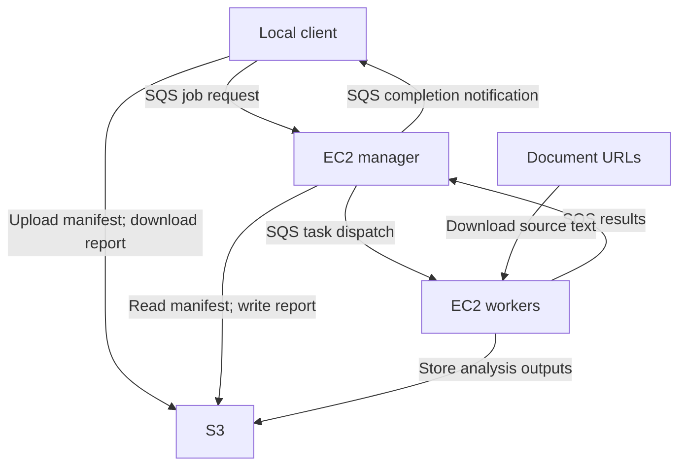

# Distributed Text Analysis on AWS

A distributed Java application that runs NLP tasks across AWS EC2 workers and returns an HTML report with links to the results.

The project implements the cloud orchestration around text analysis: provisioning workers, dispatching tasks through SQS, handling results from independent processes, and storing outputs in S3.

**Java 11 · AWS EC2 · SQS · S3 · Stanford CoreNLP · Maven**

## Engineering highlights

- **Automatic worker provisioning:** The manager reuses existing EC2 workers and launches more based on the job's task count, with a configured target limit of 19 workers per provisioning calculation.
- **Asynchronous processing:** Separate SQS queues carry job requests, worker tasks, and results. S3 stores input manifests and analysis outputs.
- **Concurrent job orchestration:** A Java executor handles submitted jobs, while each client uses a dedicated response queue for its completion notification.
- **Result aggregation and recovery:** The manager deduplicates results by task ID within a job execution, records worker errors, and can recover missing result records from existing S3 outputs.
- **Worker resource management:** Workers initialize NLP pipelines lazily and process documents line by line, with a 500,000-character limit per task.

## Architecture



1. The client uploads a manifest of document URLs and requested analyses, then submits a job.
2. The manager provisions workers and sends one task per manifest entry.
3. Workers download documents, run Stanford CoreNLP, and upload their outputs.
4. The manager collects results and generates an HTML summary; the client downloads it.

| Component | Implementation |
| --- | --- |
| CLI and job submission | [LocalMain.java](local/src/main/java/local/LocalMain.java) |
| Worker provisioning and orchestration | [ManagerMain.java](manager/src/main/java/manager/ManagerMain.java) |
| Document processing and result reporting | [WorkerMain.java](worker/src/main/java/worker/WorkerMain.java) |

## Example job

The bundled [sample manifest](local/src/main/resources/input-sample.txt) requests three analyses for each of three Project Gutenberg documents: **nine tasks in total**.

| Analysis | Result |
| --- | --- |
| Part-of-speech tagging | Words paired with grammatical tags |
| Constituency parsing | Sentence parse trees |
| Dependency parsing | Grammatical relationships between words |

The HTML report links each source document to its output, or displays an error for a failed task. [local-output.html](local-output.html) shows the report structure; its historical S3 links expire.

## Build and deployment

<details>
<summary>View prerequisites, AWS setup, and run commands</summary>

### Requirements

- JDK 11 or later and Maven locally.
- An AWS account and credentials for EC2, SQS, and S3, including permission to pass the configured instance role.
- Manager and worker AMIs with Java and the AWS CLI installed. Startup scripts assume `/home/ec2-user`.

### AWS configuration

Update the AWS constants in the three entry-point classes for your account: region, bucket names, queue URLs, AMIs, security group, instance profile, and key pair. Review the region in the EC2 startup scripts as well. The Java clients currently select `us-east-1` explicitly.

Create three S3 buckets for inputs, outputs, and JARs, plus shared standard SQS queues for jobs, tasks, and results. The client creates its own per-job response queue. The manager purges worker queues on startup by default; review that setting before restarting it with pending work.

Credentials are loaded through the [AWS SDK default credentials provider](https://docs.aws.amazon.com/sdk-for-java/latest/developer-guide/credentials-chain.html), with instance roles used on EC2.

### Build and upload

From the repository root:

```bash
mvn clean package

JARS_BUCKET=your-jars-bucket
aws s3 cp manager/target/manager-1.0-SNAPSHOT.jar "s3://${JARS_BUCKET}/manager.jar"
aws s3 cp worker/target/worker-1.0-SNAPSHOT.jar "s3://${JARS_BUCKET}/worker.jar"
```

### Run the sample

```bash
java -jar local/target/local-1.0-SNAPSHOT.jar \
  local/src/main/resources/input-sample.txt \
  output.html \
  3 terminate
```

The third argument is the positive tasks-per-worker value `n`. The manager targets `min(19, ceil(taskCount / n))` workers, so the nine-task sample with `n=3` targets three workers.

Open `output.html` after completion. The optional `terminate` argument requests shutdown of the manager and workers after current jobs complete. Without it, instances continue running. S3 objects and shared queues remain; verify instance shutdown when finished.

Logs are written to `/home/ec2-user/manager.log` and `/home/ec2-user/worker.log` on their respective instances.

</details>

## Current scope and next steps

Deployment settings currently target an AWS lab environment, and job state is held in memory. Result deduplication and S3 recovery checks provide specific recovery mechanisms; durable job recovery, bounded retries, centralized result routing, and integration tests are future improvements.

SQS can deliver duplicate messages, and fixed visibility timeouts do not guarantee that a task executes only once. See [AWS delivery semantics](https://docs.aws.amazon.com/AWSSimpleQueueService/latest/SQSDeveloperGuide/standard-queues-at-least-once-delivery.html).

## License

See [LICENSE](LICENSE).
